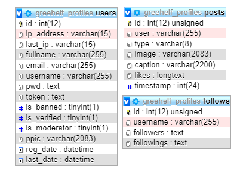

# grstgrm-api 

A Mobile App Backend API system that was made for my <a href="https://github.com/Rubinskiy/react-native-social-platform"> Unfinished React Native based social platform</a>. 
This project was written in PHP7? I forgor💀

And is connected to a MySQL MariaDB database.
Also hosted on LiteSpeed web server.

The image below is how the database structure looks like.

